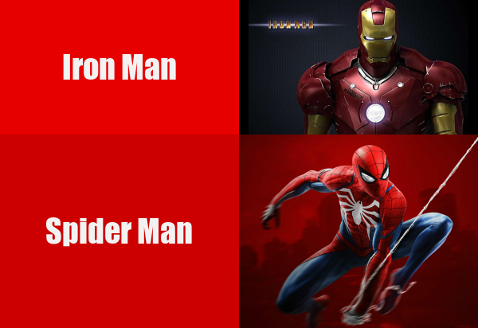

# **Hello 😁 people who are reading my repository now**

## Let me introduce you to my meme！

#### *I used [{magick}](https://cran.r-project.org/web/packages/magick/vignettes/intro.html) package for creating my meme photo*


### 1. These are the original images: 
 


### 2. That's the image that I create: 




### 3. Here is my R code:

```r
library(magick)

url_1 = "https://i.ytimg.com/vi/FlhHq_z6MHk/maxresdefault.jpg"
meme1 <- image_read(url_1) %>% 
  image_scale(300)


text1 <- image_blank(width = 300, height = 169, color = "#e60000") %>%
  image_annotate(text = "Iron Man", color = "#f2f2f2", size = 40, font = "Impact", gravity = "center")


url_2 = "http://x0.ifengimg.com/res/2019/C2D4F9E74371F0AB1B6AC13E30D876BDD34363F4_size147_w995_h806.jpeg"
meme2<- image_read(url_2) %>% 
  image_scale(300)  


text2 <- image_blank(width = 300, height = 243, color = "#cc0000") %>%
  image_annotate(text = "Spider Man", color = "#f2f2f2", size = 40, font = "Impact", gravity = "center")

ironman_vector <- c(text1, meme1)
a_row <- image_append(ironman_vector)

SpiderMan_vector <- c(text2, meme2)
b_row <- image_append(SpiderMan_vector)

result <- c(a_row, b_row) %>% image_append(stack = TRUE) %>% image_scale(600)
image_write(result, "my_meme.png")
```

 - *Marvel is my favourite movies, and my favorite characters are Iron Man and Spider Man. So I decided to use Iron Man and Spider Man elements to create my meme.*

 - *In my meme, I have added text to the original images to make it easier for those who may not know Iron Man and Spider Man to distinguish between them. I used the characters' own colours for the text background (in my opinion), which is acceptable although there is a slight colour difference.*
 
 - *I used white color for the text itself, which stands out against the deep color background and catches the eye. I set the size of the text background to be the same as the image so that the image is not larger than the text or the text is larger than the image. It also makes the whole image (meme) look more balanced.*


